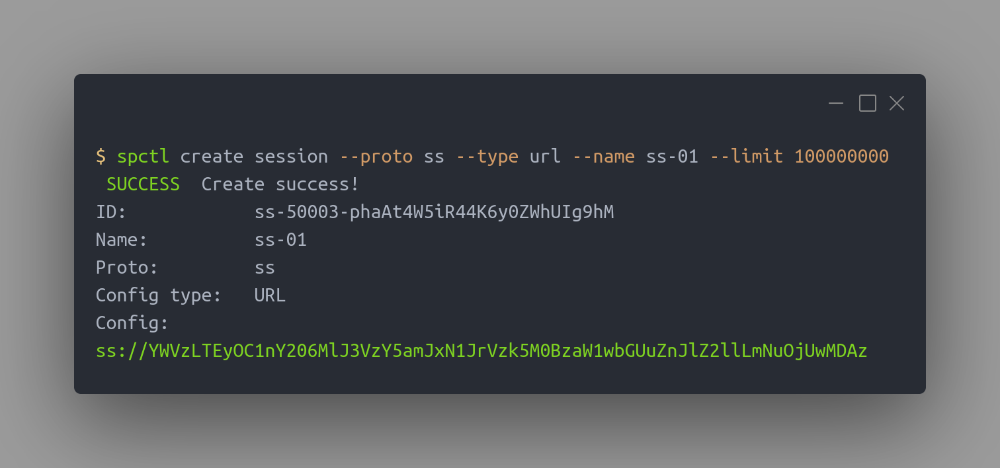
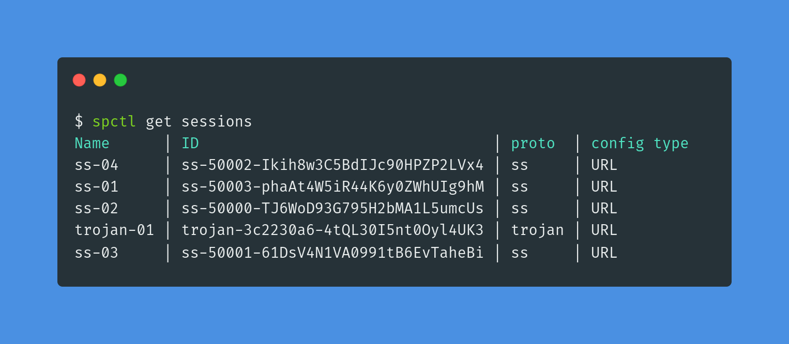
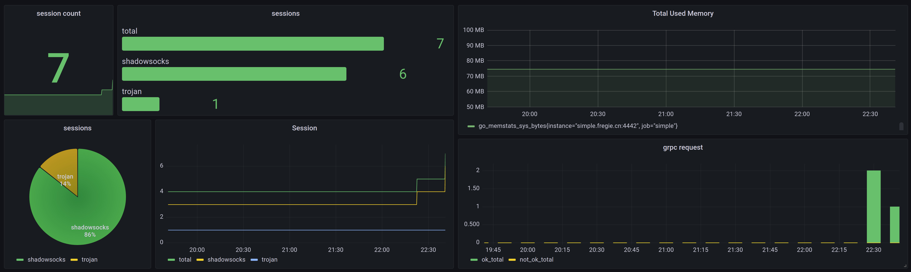

# Simple

[](https://github.com/fregie/simple/actions/workflows/gobuild.yml)  

Simple是一款网络代理/VPN服务端管理平台。使用simple来轻松管理服务器上多种不同协议的服务端。  
<!-- @import "[TOC]" {cmd="toc" depthFrom=2 depthTo=6 orderedList=false} -->

<!-- code_chunk_output -->

- [Contribute](#contribute)
- [为什么](#为什么)
- [支持的协议](#支持的协议)
- [功能](#功能)
- [Show me](#show-me)
- [安装](#安装)
  - [安装docker和docker-compose](#安装docker和docker-compose)
  - [下载docker-compose定义文件](#下载docker-compose定义文件)
  - [修改配置](#修改配置)
      - [config.yaml](#configyaml)
      - [trojan-go/server.json （不使用trojan无需修改）](#trojan-goserverjson-不使用trojan无需修改)
      - [trojan-go/simple.fregie.cn.crt & simple.fregie.cn.key （不使用trojan无需修改）](#trojan-gosimplefregiecncrt-simplefregiecnkey-不使用trojan无需修改)
  - [启动服务](#启动服务)
  - [安装命令行管理工具spctl](#安装命令行管理工具spctl)
- [使用](#使用)
  - [配置spctl](#配置spctl)
  - [session](#session)
    - [查看可用协议](#查看可用协议)
    - [创建](#创建)
    - [查看全部](#查看全部)
    - [查看特定session](#查看特定session)
    - [删除](#删除)
- [配置](#配置)
  - [Simple](#simple-1)
- [对接prometheus](#对接prometheus)

<!-- /code_chunk_output -->

## 为什么
如果你只是想在服务器上随便启动一个网络代理的服务端自己用，那么你不需要simple  
如果你想把你的服务器打造成一个强大的多协议多用户网络代理平台，那么你需要simple

## 支持的协议
- [x] trojan
- [x] shadowsocks
- [ ] openvpn
- [ ] ikev2
- [ ] WireGuard
- [ ] V2ray

## 功能
- [x] 创建、删除、查询VPN客户端配置
- [x] 配置数据持久化
- [x] 用户级限速
- [x] 容器化部署
- [x] 使用grpc api管理
- [x] 使用http api管理
- [x] 使用命令行工具(spctl)管理
- [x] 使用grpc+protobuf与VPN对接，可自由插拔不同VPN
- [x] prometheus数据指标采集
- [ ] 使用dashboard管理

## Show me




## 安装
Simple使用多服务模块化设计，需要数个服务同时运行，传统部署方式会略麻烦，推荐使用docker部署。

### 安装docker和docker-compose
[安装docker](https://docs.docker.com/engine/install/)
[安装docker-compose](https://docs.docker.com/compose/install/)

### 下载docker-compose定义文件
```shell
wget https://github.com/fregie/simple/releases/download/v1.0.2/simple-docker-compose.tar.gz
tar -xzf simple-docker-compose.tar.gz
cd docker
```

### 修改配置
启动服务前需要修改部分配置
##### config.yaml
simple的配置文件，需要将`host`字段修改为服务器的公网ip或域名
##### trojan-go/server.json （不使用trojan无需修改）
trojan-go服务端的配置文件。  
[trojan-go文档](https://p4gefau1t.github.io/trojan-go/basic/full-config/)
##### trojan-go/simple.fregie.cn.crt & simple.fregie.cn.key （不使用trojan无需修改）
trojan使用的证书，根据你服务器的域名修改

### 启动服务
```shell
docker-compose up -d
```

### 安装命令行管理工具spctl
```shell
wget https://github.com/fregie/simple/releases/download/v1.0.2/spctl
chmod +x spctl
```
`spctl`会读取$HOME目录下的`.spctl`文件作为配置文件
```shell
echo 'grpcAddr: 127.0.0.1:4433' > $HOME/.spctl
```

## 使用
### 配置spctl
配置文件`$HOME/.spctl`.  
```yaml
# simple服务的grpc地址
grpcAddr: 127.0.0.1:4433
```
### session
session是simple的基本单位，含义为一个vpn的客户端会话，可以理解为一个客户端可用的配置。
#### 查看可用协议
```shell
$ spctl get protos
Support protos:
• trojan
• ss
```
#### 创建
```shell
$ spctl create session --proto ss --type url --name ss-01        
 SUCCESS  Create success!
ID:            ss-50001-3R0v02B1tU1J1qXzDCFBhSwiX
Name:          ss-01
Proto:         ss
Config type:   URL
Config:
ss://YWVzLTEyOC1nY206M1IwdjAyQjF0VTFKMXFYekBzaW1wbGUuZnJlZ2llLmNuOjUwMDAx
```
#### 查看全部
```shell
$ spctl get sessions                                     
Name      | ID                                 | proto  | config type
ss-02     | ss-50000-TJ6WoD93G795H2bMA1L5umcUs | ss     | URL        
trojan-01 | trojan-3c2230a6-4tQL30I5nt0Oyl4UK3 | trojan | URL        
ss-01     | ss-50001-3R0v02B1tU1J1qXzDCFBhSwiX | ss     | URL        
```
#### 查看特定session
```shell
$ spctl get session ss-01 --conf
ID:            ss-50001-3R0v02B1tU1J1qXzDCFBhSwiX
Name:          ss-01
Proto:         ss
Config type:   URL
Option:
    Upload rate limit:   0 mbps
    Download rate limit: 0 mbps
Config:
ss://YWVzLTEyOC1nY206M1IwdjAyQjF0VTFKMXFYekBzaW1wbGUuZnJlZ2llLmNuOjUwMDAx
```

#### 删除
```shell
$ spctl delete session ss-01                              
 SUCCESS  Delete ss-01
```

## 配置
### Simple
config.yaml
```yaml
grpc_addr: "0.0.0.0:4433"                    # grpc服务的监听地址
grpc_gateway_addr: "0.0.0.0:4443"            # grpc_gateway的监听地址（http接口）
prom_addr: "0.0.0.0:4442"                    # export prometheus数据的http监听地址
host: simple.fregie.cn                       # 服务器host，ip或者域名，用于通知session该服务器的外网ip或域名
sqlite: /root/simple/docker/simple/simple.db # sqlite存储数据的路径，用于数据持久化
services:                                    # 接入服务的vpn服务端适配器的地址
  - "127.0.0.1:10003"
```

## 对接prometheus
simple支持通过prometheus采集指标，并通过grafana展示。  
在配置文件中增加:
```yaml
prom_addr: "0.0.0.0:4442"
```
simple会使用这个地址作为export的http addr，在prometheus配置文件中的`scrape_configs`下增加对这个地址指标的采集即可采集到数据:
```yaml
- job_name: simple
  scrape_interval: 10s
  static_configs:
  - targets:
    - your_server:4442
```
在grafana中import该dashboard: 14879
https://grafana.com/grafana/dashboards/14879